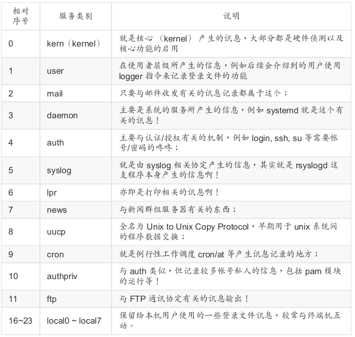
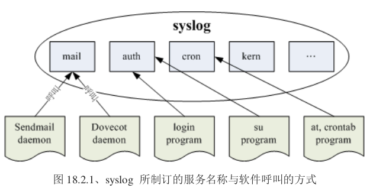
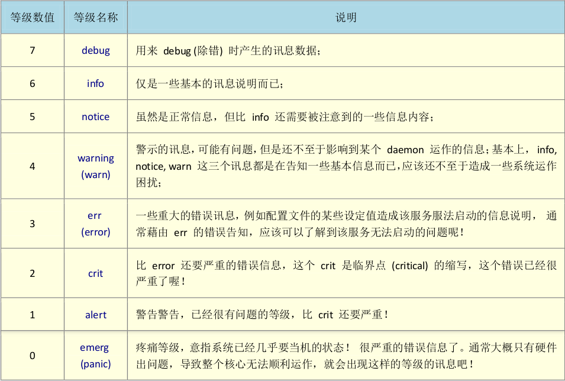
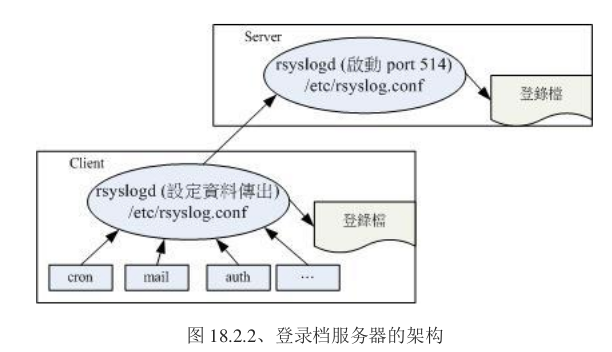

日志文件的作用：记录系统在什么时候由哪个程序有什么样的行为，发生了什么事等等。

## CentOS 7 日志文件

### 常见的日志文件

- `/var/log/boot.log`

  记录**本次开机启动**的信息。

- `/var/log/cron`

  记录与 crontab 相关的信息。

- `/var/log/dmesg`

  记录系统在**开机的时候**内核所产生的各项信息。由于 CentOS 默认将开机时内核的硬件侦测过程取消显示， 因此额外将数据记录一份在这个文件中。

- `/var/log/lastlog`

  记录系统上面所有的账号最近一次登入系统时的相关信息。`lastlog`指令就是读取该文件的。

- `/var/log/maillog 或 /var/log/mail/*`

  记录邮件的往来信息，其实主要是记录 postfix (SMTP 协议提供者，发送) 与 dovecot (POP3 协议提供者，接收) 所产生的信息。

- `/var/log/messages`

  几乎系统发生的错误信息 (或者是重要的信息) 都会记录在这个文件中。**很重要**！！！

- `/var/log/secure`

  基本上，只要牵涉到**需要输入账号密码**的软件，那么当登入时 (不管登入正确或错误) 都会被记录在此文件中。

- `/var/log/wtmp， /var/log/faillog`

  记录正确登入系统者的帐户信息 (wtmp) 与错误登入时所使用的帐户信息 (faillog)。`last`指令就是读取 wtmp 的。

- `/var/log/httpd/*， /var/log/samba/*`

  http 服务和 samba 服务日志。其他的网络服务日志也会使用各自的日志文件来存储信息。

### 日志文件所需相关服务 (daemon) 与程序

日志文件是怎么产生的呢？基本上有两种方式：

1. 由软件开发商自行定义如何写入日志文件。
2. 由 Linux distribution 提供的日志文件管理服务来统一管理。你只要将信息丢给这个服务后，他就会自己分门别类的将各种信息放置到相关的日志文件去！CentOS 提供 `rsyslog.service` 这个服务来统一管理日志文件。

CentOS 7 除了保有既有的 rsyslog.service 之外，其实最上游还使用了 systemd 自己的日志文件日志管理功能。他使用的是 `systemd-journald.service` 这个服务来支持的。所有经由 systemd 启动的服务，其产生的信息都会由 systemd-journald.service 以二进制的方式记录下来，之后再将这个信息发送给 rsyslog.service 作进一步的记录。

文件如果越来越大怎么办？那就使用 `logrotate` 来自动化处理日志文件容量与更新的问题吧。


综上所述，由系统管理的日志文件所需要的 daemon 有：

- systemd-journald.service：最主要的信息收受者，由 systemd 提供的；
- rsyslog.service：主要记录登录系统与网络等服务的信息；
- logrotate：主要进行日志文件的轮替功能。

## rsyslog.service 的配置文件

`/etc/rsyslog.conf`主要定义了：**(1)什么服务 (2)的什么等级信息 (3)需要被记录在哪里(装置或文件)**。

```bash
[root@dev ~]# vi /etc/rsyslog.conf
……
#### RULES ####
# 服务名称[.=!]信息等级 								  信息记录的文件名或装置或主机
# Log all kernel messages to the console.
# Logging much else clutters up the screen.
#kern.*                                                 /dev/console

# Log anything (except mail) of level info or higher.
# Don't log private authentication messages!
*.info;mail.none;authpriv.none;cron.none                /var/log/messages

# The authpriv file has restricted access.
authpriv.*                                              /var/log/secure

# Log all the mail messages in one place.
mail.*                                                  -/var/log/maillog

# Everybody gets emergency messages，发送给所有人
*.emerg                                                 :omusrmsg:*
……
```

**注意**：修改完配置文件之后需要重启服务：`systemctl restart rsyslog.service`

!!! warning
	rsyslogd 的登录档只要被编辑过就无法继续记录！！！此时需要重新启动 rsyslog.service 服务才行。

### 服务名称

`rsyslogd` 主要还是透过 Linux 内核提供的 `syslog` 相关规范来设定数据的分类的，Linux 的 syslog 本身有规范一些服务信息， 你可以透过这些服务来储存系统的信息。

Linux 内核的 syslog 认识的服务类型（man 3 syslog）主要有：





### 信息等级

syslog 将信息等级分为七级：



除了 0 到 6 之外还有两个比较特殊的等级， 那就是 **debug**(错误侦测等级) 与 **none** (不需登录等级) 两个，适用于想要作一些错误侦测，或者是忽略掉某些服务的信息时的情况。

- `.`  ：代表比后面还要严重的等级 (含该等级) 都被记录下来的意思。
- `.=`：代表所需要的等级就是后面接的等级而已， 其他的不要!
- `.!`：代表不等于， 亦即是除了该等级外的其他等级都记录。

### 信息记录的文件名或装置或主机

- 文件的绝对路径：通常就是放在 `/var/log` 里头的文件啦!

- 打印机或其他：例如 `/dev/lp0` 这个打印机装置

- 使用者名称：显示给用户

- 远程主机：例如 @test.com，当然啦，要对方主机也能支持才行!

- *：代表`目前在在线的所有人`，类似 `wall` 这个指令

!!! note
	使用*逗号*分隔时，那么等级只要接在最后一个即可，如果是以*分号*来分的话， 那么就需要将服务与等级都写上去。例如下面的这两种写法是一样的：

```properties
# 记录除 news，cron，mail 之外的任何程序的信息
*.*;news,cron,mail.none				/var/log/messages
*.*;news.none;cron.none;mail.none 	/var/log/messages
```

### 防止日志文件被不小心修改

前面说到，当你编辑了rsyslogd的日志文件之后，就无法继续记录了。此时可以设置一下隐藏属性：

```bash
# a 属性会让文件变为只能追加的状态，不可被修改、移动及删除
[root@dev ~]# chattr +a /var/log/messages
[root@dev ~]# lsattr /var/log/messages
-----a---------- /var/log/messages

# 看吧，不能修改哦
[root@dev ~]# vi /var/log/messages
hahahahahahahaha
~                                                                                                                                                                                                             
"/var/log/messages"
"/var/log/messages" E212: Can't open file for writing
```

但这样也会造成 logrotate 不能正常执行，解决之道请看下文。

### 设置登录服务器

对于大规模linux集群，设置一个专门的主机用来记录所有服务器的日志文件，就可以很方便的查看喽。



如上图所示，服务器会启动监听的端口，客户端则将日志文件再转出一份送到服务器去。

```bash
# 1.服务端配置
[root@centos-1810 ~]# vi /etc/rsyslog.conf
# 网络稳定就用UDP
# Provides UDP syslog reception
#$ModLoad imudp
#$UDPServerRun 514

# 想要数据稳定传输就用TCP
# Provides TCP syslog reception
#$ModLoad imtcp
#$InputTCPServerRun 514
$ModLoad imtcp
$InputTCPServerRun 514
# 重启服务
[root@centos-1810 ~]# systemctl restart rsyslog.service
[root@centos-1810 ~]# lsof -i -n -P | grep syslog
rsyslogd  30805    root    3u  IPv4 114368696      0t0  TCP *:514 (LISTEN)
rsyslogd  30805    root    4u  IPv6 114368697      0t0  TCP *:514 (LISTEN)

# 2.客户端配置
[root@dev ~]# vi /etc/rsyslog.conf
# send log to server --shihr
# TCP 设置
*.*                                                     @@172.16.7.54
# UDP 设置
#*.*                                                    @172.16.7.54
[root@dev ~]# systemctl restart rsyslog.service
```

## 日志分割（logrotate）

`logrotate`是在规定的时间到了之后才来进行日志的分割。日志分割是配置在 `anacron` 里面的：`/etc/cron.daily/logrotate`。

```bash
[root@dev ~]# cat /etc/cron.daily/logrotate 
#!/bin/sh

/usr/sbin/logrotate -s /var/lib/logrotate/logrotate.status /etc/logrotate.conf
EXITVALUE=$?
if [ $EXITVALUE != 0 ]; then
    /usr/bin/logger -t logrotate "ALERT exited abnormally with [$EXITVALUE]"
fi
exit 0
```

### logrotate 的配置文件

- `/etc/logrotate.conf`
- `/etc/logrotate.d`：该目录里面的所有文件都会被主动的读入 /etc/logrotate.conf 当中来进行

```bash
[root@dev ~]# cat /etc/logrotate.conf 
# see "man logrotate" for details
# 上面这些是默认参数，在下面的规则没有配置时就使用这些值
# rotate log files weekly
weekly

# keep 4 weeks worth of backlogs
rotate 4

# create new (empty) log files after rotating old ones
create

# use date as a suffix of the rotated file
dateext

# uncomment this if you want your log files compressed
#compress

# 定制日志的切割规则
# RPM packages drop log rotation information into this directory
include /etc/logrotate.d

# no packages own wtmp and btmp -- we'll rotate them here
/var/log/wtmp {
    monthly
    create 0664 root utmp
	minsize 1M  # 至少达到1M的大小才进行切割，高于时间参数的设置
    rotate 1
}

/var/log/btmp {
    missingok
    monthly
    create 0600 root utmp
    rotate 1
}

# system-specific logs may be also be configured here.

[root@dev ~]# cat /etc/logrotate.d/syslog 
/var/log/cron
/var/log/maillog
/var/log/messages
/var/log/secure
/var/log/spooler
{
    missingok
    sharedscripts
    postrotate
	/bin/kill -HUP `cat /var/run/syslogd.pid 2> /dev/null` 2> /dev/null || true
    endscript
}
```

logrotate配置文件的语法（`man logrotate`）：

- 日志文件的绝对路径。可以使用空格分隔多个日志文件。
- 参数。定义了何时执行等问题
- 执行脚本。可以调用外部的命令，使用`sharedscript......endscript`包围。调用的时期有两种：
  - prerotate：在启动 logrotate 之前进行的指令，例如修改日志文件的属性等动作;
  - postrotate：在做完 logrotate 之后启动的指令，例如重新启动 (kill -HUP) 某个服务!
  - prerotate 与 postrotate 对于已加上特殊属性的文件处理上面，是相当重要的执行程序!

让前文设置的隐藏属性在进行日志切割的时候暂时失效：

```bash
[root@dev ~]# vim /etc/logrotate.d/syslog
/var/log/cron
/var/log/maillog
/var/log/messages
/var/log/secure
/var/log/spooler
{
    missingok
    sharedscripts
    presrotate
		/usr/bin/chattr -a /var/log/messages
    endscript
    sharedscripts
    postrotate
		/bin/kill -HUP `cat /var/run/syslogd.pid 2> /dev/null` 2> /dev/null || true
        /usr/bin/chattr +a /var/log/messages
    endscript
}
```

### 手动执行日志分割

```
logrotate [-dv] [-f|--force] [-s|--state file] config_file ..

-d, --debug
              Turns on debug mode and implies -v.  In debug mode, no changes will be made to the logs or to the logrotate state file.

+-v, --verbose
              Turns on verbose mode, ie. display messages during rotation.
              
-f, --force
              Tells logrotate to force the rotation, even if it doesn't think this is necessary.  Sometimes this is useful after adding new entries to a logrotate config file, or if old log files have been removed by hand, as the new files will be created, and logging will continue correctly.
```

```bash
[root@dev ~]# logrotate -v -f /etc/logrotate.conf
reading config file /etc/logrotate.conf
including /etc/logrotate.d
reading config file bootlog
……
```

## systemd-journald.service

内核唤醒第一个程序`systemd`之后，他会主动呼叫`systemd-journald.service`来记录日志文件，因此在开机过程中的所有信息，包括启动服务与服务若启动失败的情况等等，都可以直接被记录到 systemd-journald 里。不过 systemd-journald 由于是使用于内存的日志文件记录方式，所以只会记录本次开机信息，而 rsyslogd 可以用来记录以前及现在的所以数据到磁盘文件中，方便未来进行查询，所以就需要两者协作啦。

### 使用 journalctl 观察登录信息

```
journalctl [OPTIONS...] [MATCHES...]

不添加任何参数时，会从最老的日志开始显示完整的系统日志
MATCHES：格式为"FIELD=VALUE"，可输入多个。全部的可用值查询： man systemd.journal-fields
	_SYSTEMD_UNIT=unit.service		只输出 unit.service 的信息
    _COMM=bash						只输出与 bash 有关的信息
    _PID=pid						只输出与 PID 号码有关的信息
	_UID=uid						只输出 UID 为 uid 的信息
	SYSLOG_FACILITY=[0-23]			使用 syslog.h 规范的服务相对序号来呼叫出正确的数据
OPTIONS
	-f, --follow					持续输出，类似于 tailf 的功能
	-r, --reverse					从最新的开始显示
	-n, --lines=					显示最近的 N 行
	-p, --priority=					根据优先级（小于等于）进行过滤。"emerg" (0), "alert" (1), "crit" (2), "err" (3), "warning" (4), "notice" (5), "info" (6), "debug" (7)
	-S, --since=, -U, --until=		格式："2012-10-30 18:17:16"
	-x, --catalog					添加消息说明（如果可用）
	-e, --pager-end					跳到显示的末尾
```

```bash
[root@dev ~]# journalctl -S "2019-11-28"
-- Logs begin at Mon 2019-11-25 08:29:16 CST, end at Fri 2019-11-29 10:40:01 CST. --
Nov 28 00:00:01 dev systemd[1]: Started Session 462 of user root.
Nov 28 00:00:01 dev CROND[32262]: (root) CMD (/usr/lib64/sa/sa1 1 1)
Nov 28 00:01:01 dev systemd[1]: Started Session 463 of user root.
Nov 28 00:01:01 dev CROND[32270]: (root) CMD (run-parts /etc/cron.hourly)
Nov 28 00:01:01 dev run-parts(/etc/cron.hourly)[32273]: starting 0anacron
Nov 28 00:01:01 dev anacron[32280]: Anacron started on 2019-11-28
Nov 28 00:01:01 dev anacron[32280]: Normal exit (0 jobs run)
```

### 使用 logger 记录到日志文件

把数据储存到日志文件。

```
logger [options] [message]

OPTIONS
	-f, --file file			Log the contents of the specified file.
	-S, --size size         Sets  the  maximum permitted message size.
	-p, --priority priority Enter the message into the log with the specified priority.格式是 facility.level，默认 user.notice。具体查阅 FACILITIES AND LEVELS 章节
```

```bash
[root@dev ~]# logger -p user.debug "test log to systemd with logger"
[root@dev ~]# journalctl -n 1
-- Logs begin at Mon 2019-11-25 08:29:16 CST, end at Fri 2019-11-29 10:59:12 CST. --
Nov 29 10:59:12 dev root[45214]: test log to systemd with logger
```

### 保存 journal 的方式

```bash
[root@dev ~]# mkdir /var/log/journal
[root@dev ~]# chown root:systemd-journal /var/log/journal/
[root@dev ~]# chmod 2755 /var/log/journal/
# 鸟哥说要重启服务才会保存，不过我这里不需要（CentOS Linux release 7.7.1908 (Core)）：systemctl restart systemd-journald.service
[root@dev ~]# tree /var/log/journal/
/var/log/journal/
└── 0242c388ca104d46b8d6d9a4b951ff3f
    └── system.journal
```

不过鸟哥说没必要再额外存储一份。

## 分析日志文件

`last, lastlog, dmesg`等指令提供的数据比较分散。了解系统的状态，还是得要分析整个日志文件才行。

### CentOS 预设提供的 logwatch

每天分析一次日志文件，并且将数据以 email 的格式寄送给 root。

先安装喽：

```bash
[root@dev ~]# yum install logwatch
# 安装完毕之后，日程下面就有文件了
[root@dev ~]# ll /etc/cron.daily/0logwatch
-rwxr-xr-x. 1 root root 434 Aug 16  2018 /etc/cron.daily/0logwatch
```

```bash
[root@dev ~]# /etc/cron.daily/0logwatch
[root@dev ~]# mail
……
################### Logwatch 7.4.0 (03/01/11) #################### 
        Processing Initiated: Fri Nov 29 15:18:29 2019
        Date Range Processed: yesterday
                              ( 2019-Nov-28 )
                              Period is day.
        Detail Level of Output: 0
        Type of Output/Format: mail / text
        Logfiles for Host: dev
 ################################################################## 
 
 --------------------- pam_unix Begin ------------------------ 

 su-l:
    Sessions Opened:
       root -> sink: 1 Time(s)
 
 sudo:
    Sessions Opened:
       root -> root: 1 Time(s)
 
 
 ---------------------- pam_unix End ------------------------- 

 
 --------------------- Connections (secure-log) Begin ------------------------ 

 
 **Unmatched Entries**
--More--
```

### 鸟哥的日志文件分析工具

下载：

[鸟哥的下载地址](http://linux.vbird.org//linux_basic/0570syslog//logfile_centos7.tar.gz)

[简体中文版地址](files/logfile_centos7.tar.gz)

```bash
[root@dev ~]# tar -zxf logfile_centos7.tar.gz -C /
```

