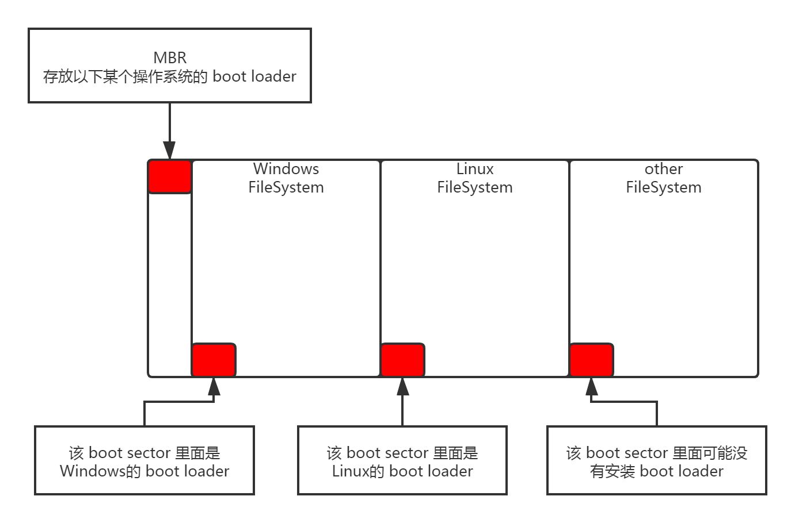
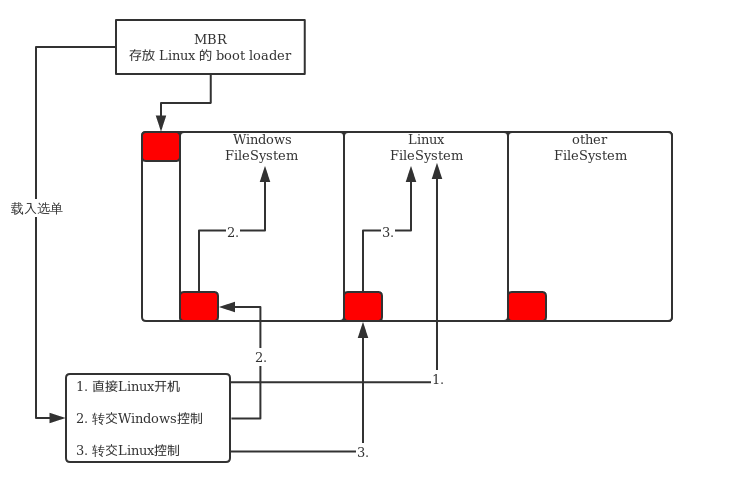
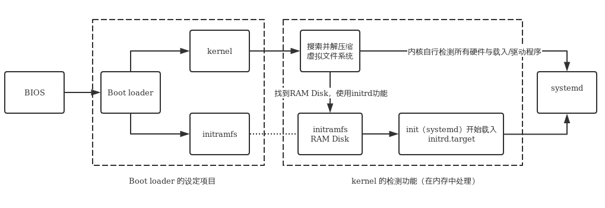

1. 加载 BIOS 的硬件信息与进行自我测试，并依据设定取得第一个可开机的装置；

2. 读取并执行第一个开机装置内 MBR 的 boot Loader (亦即是 grub2， spfdisk 等程序)；
3. 依据 boot loader 的设定加载 Kernel ，Kernel 会开始侦测硬件与加载驱动程序；
4. 在硬件驱动成功后，Kernel 会主动呼叫 systemd 程序，并以 default.target 流程开机；
- systemd 执行 sysinit.target 初始化系统及 basic.target 准备操作系统；
- systemd 启动 multi-user.target 下的本机与服务器服务；
- systemd 执行 multi-user.target 下的 /etc/rc.d/rc.local 文件；
- systemd 执行 multi-user.target 下的 getty.target 及登入服务；
- systemd 执行 graphical 需要的服务

本文名词说明：

- BIOS：不论传统 BIOS 还是 UEFI BIOS 都会被简称为 BIOS；

- MBR：虽然分区表有传统 MBR 以及新式 GPT，不过 GPT 也有保留一块兼容 MBR 的区块，MBR 就代表该磁盘的最前面可安装 boot loader 的那个区块。

## BIOS， boot loader 与 kernel 载入

### BIOS， 开机自我测试与 MBR/GPT

在个人计算机架构下，你想要启动整部系统首先就得要让系统去加载 `BIOS` (Basic Input Output System)，并透过 BIOS 程序去加载 CMOS 的信息，并且藉由 CMOS 内的设定值取得主机的各项硬件配置；进行开机自我测试 (Power-on Self Test， POST) 。 然后开始执行硬件侦测的初始化，并设定 PnP 装置，之后再定义出可开机的装置顺序，接下来就会开始进行开机装置的数据读取了。

但由于不同的操作系统他的文件系统格式不相同，因此我们必须要以一个开机管理程序来处理内核文件加载 (load) 的问题，即 `Boot Loader`。该程序安装在在开机装置的第一个扇区 (sector) 内，即 `MBR` (Master Boot Record， 主要启动记录区)。

因为每个操作系统都有自己的 boot loader ，所以 BIOS 是透过硬件的 `INT 13` 中断功能来读取 MBR 的。只要 BIOS 能够检测的到你的磁盘，它就能读取到 boot loader 并执行。

!!! note
	每颗硬盘的最前面区块含有 MBR 或 GPT 分区表的提供 loader 的区块，读取哪个要看BIOS 的设置了。系统的 MBR 其实指的是 **第一个开机设备的 MBR**。

### Boot Loader 的功能

问题：必须要使用自己的 loader 才能够加载属于自己的操作系统内核，但是系统的 MBR 只有一个，那么该如何安装多个操作系统呢？

其实每个文件系统 (filesystem，或者是 partition) 都会保留一块启动扇区 (boot sector) 提供操作系统安装 boot loader ， 而通常操作系统默认都会安装一份 loader 到它根目录所在的文件系统的 boot sector 上。下面是 boot loader 存放示意图：



如上图所示，每个操作系统默认是会安装一套 boot loader 到他自己的文件系统中。在 Linux 系统安装时，将 boot loader 安装到 MBR 去是可选的；在 Windows 安装时，他预设会主动的将 MBR 与 boot sector 都装上一份。boot loader 主要的功能如下：

- 提供选单：用户可以选择不同的开机项目，这也是多重引导的重要功能！
- 载入内核文件：直接指向可开机的程序区段来开始操作系统；
- 转交其他 loader：将开机管理功能转交给其他 loader 负责。

由于具有选单功能，因此我们可以选择不同的内核来开机。而由于具有控制权转交的功能，因此我们可以加载其他 boot sector 内的 loader 啦！不过 **Windows 的 loader 预设不具有控制权转交的功能**，因此你不能使用 Windows 的 loader 来加载 Linux 的 loader！所以在**安装多重操作系统时必须要先安装Windows**！



最终 boot loader 的功能就是加载**kernel 文件**啦。

### 加载内核检测硬件与 initramfs 的功能

藉由 boot loader 的管理而开始读取内核文件后，接下来， Linux 就会将内核解压缩到主存储器当中， 并且利用内核的功能，开始测试与驱动各个周边装置。此时 Linux 内核会以自己的功能重新侦测一次硬件，而不一定会使用 BIOS 侦测到的硬件信息！也就是说，**内核此时开始接管 BIOS 后的工作**了。

内核文件`/boot/vmlinuz`：

```bash
[sink@dev ~]$ ls -1 /boot/
config-3.10.0-1062.el7.x86_64	# 此版本内核被编译时选择的功能与模块配置文件
efi
extlinux
grub							# 旧版 grub，不管它
grub2							# 开机管理程序 grub2 相关数据目录
initramfs-0-rescue-0242c388ca104d46b8d6d9a4b951ff3f.img	# 救援用的虚拟文件系统文件
initramfs-3.10.0-1062.el7.x86_64.img					# 正常开机会用到的虚拟文件系统
initramfs-3.10.0-1062.el7.x86_64kdump.img				# 内核出问题时会用到的虚拟文件系统
initrd-plymouth.img
symvers-3.10.0-1062.el7.x86_64.gz
System.map-3.10.0-1062.el7.x86_64						# 内核功能放置到内存地址的对应表
vmlinuz-0-rescue-0242c388ca104d46b8d6d9a4b951ff3f		# 救援用的内核文件
vmlinuz-3.10.0-1062.el7.x86_64							# 内核文件
```

Linux 内核是可以通过动态加载内核模块的(就请想成驱动程序即可)，这些内核模块就放置在 `/lib/modules/` 目录内。由于模块放置到磁盘根目录内 (要记得 **/lib 不可以与 / 分别放在不同的 partition** !)， 因此在开机的过程中**内核必须要挂载根目录，这样才能够读取内核模块提供加载驱动程序**的功能。 而且为了担心影响到磁盘内的文件系统，因此开机过程中根目录是以只读的方式来挂载的。

一般来说，非必要的功能且可以编译成为模块的内核功能，目前的 Linux distributions 都会将他编译成为模块。因此 **USB， SATA， SCSI... 等磁盘装置的驱动程序通常都是以模块的方式来存在的**。

问题是，内核根本不认识 SATA 磁盘，所以需要加载 SATA 磁盘的驱动程序， 否则根本就无法挂载根目录。但是 SATA 的驱动程序在 */lib/modules* 内，你根本无法挂载根目录又怎么读取到 */lib/modules/* 内的驱动程序？解决该问题的方法就是虚拟文件系统。

**虚拟文件系统** (Initial RAM Disk 或 Initial RAM Filesystem) 一般使用的文件名为 `/boot/initrd` 或 `/boot/initramfs`。也能够透过 boot loader 来加载到内存中，然后这个文件会被解压缩并且**在内存当中仿真成一个根目录**， 且此仿真在内存当中的文件系统能够提供一支可执行的程序，透过该程序来加载开机过程中所最需要的内核模块， 通常这些模块就是 USB， RAID， LVM，SCSI 等文件系统与磁盘接口的驱动程序啦！等载入完成后， **会帮助内核重新呼叫 systemd 来开始后续的正常开机流程**。



更详细的 initramfs 说明，使用 `man initrd`查阅。

initramfs 文件内容：

```bash
[root@dev boot]$ lsinitrd initramfs-3.10.0-1062.el7.x86_64.img
# 数据介绍，会占用容量
Image: initramfs-3.10.0-1062.el7.x86_64.img: 31M
========================================================================
Early CPIO image
========================================================================
drwxr-xr-x   3 root     root            0 Oct 22 16:19 .
-rw-r--r--   1 root     root            2 Oct 22 16:19 early_cpio
drwxr-xr-x   3 root     root            0 Oct 22 16:19 kernel
drwxr-xr-x   3 root     root            0 Oct 22 16:19 kernel/x86
drwxr-xr-x   2 root     root            0 Oct 22 16:19 kernel/x86/microcode
-rw-r--r--   1 root     root       100352 Oct 22 16:19 kernel/x86/microcode/GenuineIntel.bin
========================================================================
Version: dracut-033-564.el7

Arguments: -f

# 所有的模块
dracut modules:
bash
nss-softokn
i18n
……
shutdown
========================================================================
# 所有的文件
drwxr-xr-x  12 root     root            0 Oct 22 16:19 .
crw-r--r--   1 root     root       5,   1 Oct 22 16:19 dev/console
crw-r--r--   1 root     root       1,  11 Oct 22 16:19 dev/kmsg
crw-r--r--   1 root     root       1,   3 Oct 22 16:19 dev/null
lrwxrwxrwx   1 root     root            7 Oct 22 16:19 bin -> usr/bin
……
lrwxrwxrwx   1 root     root           23 Oct 22 16:19 init -> usr/lib/systemd/systemd
lrwxrwxrwx   1 root     root            9 Oct 22 16:19 lib64 -> usr/lib64
lrwxrwxrwx   1 root     root            7 Oct 22 16:19 lib -> usr/lib
……
drwxr-xr-x   2 root     root            0 Oct 22 16:19 usr/lib/dracut/hooks/mount
drwxr-xr-x   2 root     root            0 Oct 22 16:19 usr/lib/dracut/hooks/netroot
……
lrwxrwxrwx   1 root     root            6 Oct 22 16:19 var/run -> ../run
========================================================================
```

解压查看内容：

```bash
[root@dev boot]# mkdir /tmp/initramfs
[root@dev boot]# cd /tmp/initramfs
[root@dev initramfs]# cp /boot/initramfs-3.10.0-1062.el7.x86_64.img .
[root@dev initramfs]# file initramfs-3.10.0-1062.el7.x86_64.img 
initramfs-3.10.0-1062.el7.x86_64.img: ASCII cpio archive (SVR4 with no CRC)
[root@dev initramfs]# cpio -i -d -H newc --no-absolute-filenames < initramfs-3.10.0-1062.el7.x86_64.img 
198 blocks
[root@dev initramfs]# ll
# 这里就对应了 lsinitrd 列出信息的前三部分
total 31188
-rw-r--r--. 1 root root        2 Dec  5 16:10 early_cpio
-rw-------. 1 root root 31929564 Dec  5 16:10 initramfs-3.10.0-1062.el7.x86_64.img
drwxr-xr-x. 3 root root       17 Dec  5 16:10 kernel
```
要想真正地解压 *initramfs.img*，就要先去掉去除前面不需要的文件头数据部份即偏移量：

计算偏移量的方法：

- 方法一：其实*initramfs.img*是cpio打包的gzip格式的文件，gzip文件压缩的又是cpio打包的目录，所以需要知道gzip文件在最外层的cpio文件的偏移量。而gzip格式的文件开头字节是`0x1f 0x8b 0x08`，所以只要查找出这几个字节的偏移量即可。

```bash
# 命令一。每一个单元代表一个字节，所以偏移量是 101376 + 0 = 101376
# -t 输出格式，x1 表示每个整数占1个字节，-A 文件偏移量格式，d 表示使用带符号的十进制
[root@dev initramfs]# od -t x1 -A d initramfs-3.10.0-1062.el7.x86_64.img | grep "1f 8b 08"
0101376 1f 8b 08 00 9e bb ae 5d 02 03 9c bd 07 5c 13 4d
# 命令二。每一个单元代表一个字节，所以偏移量是 0018c00(十六进制) = 101376(十进制)
[root@dev initramfs]# xxd -g 1 initramfs-3.10.0-1062.el7.x86_64.img | grep "1f 8b 08"
0018c00: 1f 8b 08 00 9e bb ae 5d 02 03 9c bd 07 5c 13 4d  .......].....\.M
^C
```

- 方法二：获取 kernel 目录下的文件 `kernel/x86/microcode/GenuineIntel.bin` 的大小，然后加上1024，即得到偏移量。看出来的规律，我也不知道为什么。//TODO

解压过程：

```bash
# 首先计算出偏移量为 0101376 
[root@dev initramfs]# dd if=initramfs-3.10.0-1062.el7.x86_64.img of=initramfs.gz bs=0101376 skip=1
[root@dev initramfs]# file initramfs.gz 
initramfs.gz: gzip compressed data, from Unix, last modified: Tue Oct 22 16:19:42 2019, max compression
[root@dev initramfs]# mkdir initramfs && mv initramfs.gz initramfs/ && cd initramfs/
# 先用 gzip 解压
[root@dev initramfs]# gzip -d initramfs.gz 
# 解压出来一个 cpio 文件
[root@dev initramfs]# ll
total 64348
-rw-r--r--. 1 root root 65891328 Dec  5 16:57 initramfs
[root@dev initramfs]# file initramfs 
initramfs: ASCII cpio archive (SVR4 with no CRC)
# 再用 cpio 解压
[root@dev initramfs]# cpio -i -d -F initramfs --no-absolute-filenames -c
[root@dev initramfs]# ll
total 64356
lrwxrwxrwx.  1 root root        7 Dec  5 17:10 bin -> usr/bin
drwxr-xr-x.  2 root root       45 Dec  5 17:10 dev
drwxr-xr-x. 12 root root     4096 Dec  5 17:10 etc
lrwxrwxrwx.  1 root root       23 Dec  5 17:10 init -> usr/lib/systemd/systemd
-rw-r--r--.  1 root root 65891328 Dec  5 16:57 initramfs		# 这是原文件
lrwxrwxrwx.  1 root root        7 Dec  5 17:10 lib -> usr/lib
lrwxrwxrwx.  1 root root        9 Dec  5 17:10 lib64 -> usr/lib64
drwxr-xr-x.  2 root root        6 Dec  5 17:10 proc
drwxr-xr-x.  2 root root        6 Dec  5 17:10 root
drwxr-xr-x.  2 root root        6 Dec  5 17:10 run
lrwxrwxrwx.  1 root root        8 Dec  5 17:10 sbin -> usr/sbin
-rwxr-xr-x.  1 root root     3117 Dec  5 17:10 shutdown
drwxr-xr-x.  2 root root        6 Dec  5 17:10 sys
drwxr-xr-x.  2 root root        6 Dec  5 17:10 sysroot
drwxr-xr-x.  2 root root        6 Dec  5 17:10 tmp
drwxr-xr-x.  7 root root       66 Dec  5 17:10 usr
drwxr-xr-x.  2 root root       29 Dec  5 17:10 var
```

整个文件夹就类似于一个根目录，这样kernel就能挂载了。

```bash
# 看看默认的操作环境，指向的就是 initrd.target
[root@dev initramfs]# ll usr/lib/systemd/system/default.target 
lrwxrwxrwx. 1 root root 13 Dec  6 08:40 usr/lib/systemd/system/default.target -> initrd.target
```

initrd.target 也是需要读入一堆例如 basic.target， sysinit.target 等等的硬件检测、内核功能启用的流程， 然后开始让系统顺利运作。**最终才又卸载 initramfs 的小型文件系统，实际挂载系统的根目录**。

同理，直接将开机所需模块编译到内核中，也能顺利启动了。

## 第一个程序 systemd 及使用 default.target 进入开机程序分析

systemd 最主要的功能就是准备软件执行的环境，包括系统的主机名、网络设定、语系处理、文件系统格式及其他服务的启动等。 而所有的动作都会透过 systemd 的默认启动服务集合，亦即是 `/etc/systemd/system/default.target` 来规划。

### 兼容于 runlevel 的等级

systemd 为了兼容于旧式的 `system V` 操作行为, 所以也将 `runlevel` 与操作环境做了结合：

```bash
[root@dev ~]# ll /usr/lib/systemd/system/runlevel?.target
lrwxrwxrwx. 1 root root 15 Oct 22 16:01 /usr/lib/systemd/system/runlevel0.target -> poweroff.target
lrwxrwxrwx. 1 root root 13 Oct 22 16:01 /usr/lib/systemd/system/runlevel1.target -> rescue.target
lrwxrwxrwx. 1 root root 17 Oct 22 16:01 /usr/lib/systemd/system/runlevel2.target -> multi-user.target
lrwxrwxrwx. 1 root root 17 Oct 22 16:01 /usr/lib/systemd/system/runlevel3.target -> multi-user.target
lrwxrwxrwx. 1 root root 17 Oct 22 16:01 /usr/lib/systemd/system/runlevel4.target -> multi-user.target
lrwxrwxrwx. 1 root root 16 Oct 22 16:01 /usr/lib/systemd/system/runlevel5.target -> graphical.target
lrwxrwxrwx. 1 root root 13 Oct 22 16:01 /usr/lib/systemd/system/runlevel6.target -> reboot.target
```

切换执行等级可以使用`init <number>`来执行，例如：`init 3`，相当于 `systemctl isolate multi-user.target`。

### systemd 的处理流程

CentOS 7.x 的 systemd 开机流程大约是这样：

1. local-fs.target + swap.target：这两个 target 主要在挂载本机 `/etc/fstab` 里面所规范的文件系统与相关的内存交换空间。
2. sysinit.target：这个 target 主要在侦测硬件，加载所需要的内核模块等动作。
3. basic.target：加载主要的外部硬件驱动程序与防火墙相关任务
4. multi-user.target 底下的其它一般系统或网络服务的加载
5. 图形界面相关服务如 gdm.service 等其他服务的加载

下面简要介绍一下这些target的作用是什么，详细的服务还是根据配置的依赖关系查看吧，`systemctl list-dependencies xxx`。

#### sysinit.target 初始化系统、basic.target 准备系统

##### sysinit.target 大致内容

- 特殊文件系统装置的挂载：包括 dev-hugepages.mount dev-mqueue.mount 等挂载服务，主要在挂载跟巨量内存分页使用与消息队列的功能。 挂载成功后，会在 /dev 底下建立 /dev/hugepages/， /dev/mqueue/ 等目录;
- 特殊文件系统的启用：包括磁盘阵列、网络驱动器 (iscsi)、LVM 文件系统、文件系统对照服务 (multipath)等等，也会在这里被侦测与使用到！
- 开机过程的讯息传递与动画执行：使用 plymouthd 服务搭配 plymouth 指令来传递动画与讯息
- 日志式系统日志文件的使用：就是 systemd-journald 这个服务的启用啊！
- 加载额外的内核模块：透过 `/etc/modules-load.d/*.conf` 文件的设定，让内核额外加载管理员所需要的内核模块！
- 加载额外的内核参数设定：包括 `/etc/sysctl.conf` 以及 `/etc/sysctl.d/*.conf` 内部设定！
- 启动系统的随机数生成器：随机数生成器可以帮助系统进行一些密码加密演算的功能
- 设定终端机 (console) 字形
- 启动动态设备管理器：就是 udevd 这个家伙！用在动态对应实际装置存取与装置文件名对应的一个服务！相当重要喔！也是在这里启动的！

##### basic.target 大致内容

sysinit.target 在初始化系统，而这个 basic .target 则是一个最简陋的操作系统了。

- 加载 alsa 音效驱动程序：这个 alsa 是个音效相关的驱动程序，会让你的系统有音效产生啰；
- 载入 firewalld 防火墙：CentOS 7.x 以后使用 firewalld 取代 iptables 的防火墙设定，虽然最终都是使用 iptables 的架构， 不过在设定上面差很多喔！
- 加载 CPU 的微指令功能；
- 启动与设定 SELinux 的安全本文：如果由 disable 的状态改成 enable 的状态，或者是管理员设定强制重新设定一次 SELinux 的安全本文， 也在这个阶段处理喔！
- 将目前的开机过程所产生的开机信息写入到 /var/log/dmesg 当中
- 由 /etc/sysconfig/modules/*.modules 及 /etc/rc.modules 加载管理员指定的模块！
- 加载 systemd 支持的 timer 功能

#### 启动 multi-user.target 下的服务

basic.target 让系统成为操作系统的基础，之后就是服务器要顺利运作时，需要的各种主机服务以及提供服务器功能的网络服务的启动了。这些服务的启动则大多是附挂在 multi-user.target 这个操作环境底下。

##### 兼容 systemV 的 rc-local.service

在以前的版本中，当系统完成开机后还想要让系统额外执行某些程序的话，可以将该程序指令或脚本的绝对路径名称写入到 `/etc/rc.d/rc.local` 这个文件去！新的 systemd 机制中，它建议直接写一个 systemd 的启动脚本配置文件到 /etc/systemd/system 底下，然后使用systemctl enable 的方式来设定启用它，而不要直接使用 rc.local 这个文件。

```bash
[sink@dev boot]$ cat /etc/rc.d/rc.local 
#!/bin/bash
# THIS FILE IS ADDED FOR COMPATIBILITY PURPOSES
#
# It is highly advisable to create own systemd services or udev rules
# to run scripts during boot instead of using this file.
#
# In contrast to previous versions due to parallel execution during boot
# this script will NOT be run after all other services.
#
# Please note that you must run 'chmod +x /etc/rc.d/rc.local' to ensure
# that this script will be executed during boot.

touch /var/lock/subsys/local
```

##### 提供 tty 界面与登入的服务

由于服务都是同步运作，不一定哪个服务先启动完毕。如果 `getty` 服务先启动完毕时，你会发现到有可用的终端机尝试让你登入系统了。 问题是，如果 `systemd-logind.service` 或 `systemd-user-sessions.service` 服务尚未执行完毕的话，那么你还是无法登入系统的。

#### 启动 graphical.target 下的服务

```bash
[sink@dev ~]$ systemctl list-dependencies graphical.target
graphical.target
● ├─accounts-daemon.service
● ├─gdm.service					# 让用户可以利用图形界面登入的最重要服务
● ├─network.service
● ├─rtkit-daemon.service
● ├─systemd-readahead-collect.service
● ├─systemd-readahead-replay.service
● ├─systemd-update-utmp-runlevel.service
● └─multi-user.target
●   ├─abrt-ccpp.service
●   ├─abrt-oops.service
```

## 开机过程会用到的主要配置文件

systemd 有自己的配置文件处理方式，不过为了兼容于 systemV ,其实很多的服务脚本设定还是会读取位于 `/etc/sysconfig/` 底下的环境配置文件。

### 模块配置文件

`sysinit.target`中有加载用户自定义模块的地方：

- `/etc/modules-load.d/*.conf`：单纯要内核加载模块的位置；
- `/etc/modprobe.d/*.conf`：可以加上模块参数的位置。

systemd 在开机时已经把需要的驱动都加载了，基本上无需改动。如果你有某些特定的参数要处理时，才需要在这里做一些处理。

下面是鸟哥举的一个例子。

在前文中我们向 vdftpd de端口改成了 555，其中一个针对 FTP 很重要的防火墙模块为 *nf_conntrack_ftp*，你可以将这个模块写入到系统开机流程中：

```bash
[root@dev ~]# cat /etc/modules-load.d/sink.conf
nf_conntrack_ftp
```

一个模块 (驱动程序) 写一行。上述的模块基本上是针对默认 FTP 端口 21 所设定的，如果需要调整到 port 555 的话，得在另一个目录下外带参数才行：

```bash
[root@dev ~]# cat /etc/modprobe.d/sink.conf
options nf_conntrack_ftp ports=555
```

之后重新启动就能够顺利的载入并且处理好这个模块了。那么非重启的方法是什么呢：

```bash
[root@dev ~]# lsmod | grep nf_conntrack_ftp
[root@dev ~]# systemctl restart systemd-modules-load.service 
[root@dev ~]# lsmod | grep nf_conntrack_ftp
nf_conntrack_ftp       18478  0 
nf_conntrack          139224  8 nf_nat,nf_nat_ipv4,nf_nat_ipv6,xt_conntrack,nf_nat_masquerade_ipv4,nf_conntrack_ftp,nf_conntrack_ipv4,nf_conntrack_ipv6
```

### 其它的环境配置文件

这些文件都在`/etc/sysconfig/`目录下：

- `authconfig`

  这个文件主要在规范使用者的身份认证的机制，包括是否使用本机的 /etc/passwd， /etc/shadow 等， 以及 /etc/shadow 密码记录使用何种加密算法，还有是否使用外部密码服务器提供的账号验证 (NIS, LDAP) 等。使用 `authconfig-tui` 来修改。

- `cpupower`

  `cpupower.service`服务使用的配置文件。主要是 Linux 内核如何操作 CPU 的规则。 一般来说,启动 cpupower.service 之后，系统会让 CPU 以最大效能的方式来运作，否则预设就是用多少算多少的模式来处理的。

- `firewalld, iptables-config, iptables-config, ebtables-config`

  防火墙服务。参考服务器篇。

- `network-scripts/`

  设定网卡。参考服务器篇。

## 内核与内核模块

在上文中提到，在整个开机的过程当中，是否能够成功的驱动我们主机的硬件设备，是内核 (kernel) 的工作。目前的内核都具有 modules (模块化) 的功能。

内核与内核模块的位置：

- 内核： /boot/vmlinuz 或 /boot/vmlinuz-version；
- 内核解压缩所需 RAM Disk： /boot/initramfs (/boot/initramfs-version)；
- 内核模块： /lib/modules/version/kernel 或 /lib/modules/$(uname -r)/kernel；
- 内核原码： /usr/src/linux 或 /usr/src/kernels/ (要安装才会有,预设不安装)。

如果该内核被顺利的加载系统当中了,那么就会有几个信息纪录下来:

- 内核版本：/proc/version
- 系统内核功能：/proc/sys/kernel/

如果有个新的硬件，让系统支持的两种方法：

- 重新编译内核,并加入最新的硬件驱动程序原始码；
- 将该硬件的驱动程序编译成为模块，在开机时加载该模块。

关于编译的方法，可以参考后续章节。下面说明一下如何加载一个已存在的模块。

### 内核模块与依赖

内核模块一般放在`/lib/modules/$(uname -r)/kernel`目录下：

```bash
[root@dev ~]# ls -1 /lib/modules/$(uname -r)/kernel/
arch	# 与硬件平台有关的项目,例如 CPU 的等级等等
crypto	# 内核所支持的加密的技术,例如 md5 或者是 des 等等
drivers	# 一些硬件的驱动程序
fs		# 内核所支持的文件系统
kernel
lib		# 一些函数库;
mm
net		# 与网络有关的各项协议数据,还有防火墙模块 (net/ipv4/netfilter/*) 等等;
sound	# 与音效有关的各项模块;
virt
```

`/lib/modules/$(uname -r)/modules.dep`文件记录了在内核支持的模块的各项依赖。利用 `depmod` 这个指令就可以建立该文件：

```
depmod -[aA] [options] [forced_version]
输出适用于 modprobe 的依赖列表
不加任何选项等同于“depmod -a”

Options:
	-a, --all            Probe all modules，并写入到文件中
	-A, --quick          找到新模块才更新文件
	-n, --show           不写入 modules.dep ,而是将结果输出到屏幕上(standard out)
	-e, --errsyms        显示出目前已加载的不可执行的模块名称
```

若我做好一个网卡驱动程序 *a.ko*，该如何更新核心的依赖：

```bash
cp a.ko /lib/modules/$(uname -r)/kernel/drivers/net
depmod
```

### 内核模块的查看

列出模块、大小、依赖：

```bash
[root@dev ~]# lsmod 
# 名字				   大小  此模块是否被其他模块所使用
Module                  Size  Used by
nf_conntrack_ftp       18478  0 
tcp_lp                 12663  0 
llc                    14552  2 stp,bridge
……
```

查看具体的某个模块的信息：

```
modinfo [options] filename [args]
filename 可以是模块名字或模块文件
Options:
	-a, --author                Print only 'author'
	-d, --description           Print only 'description'
	-l, --license               Print only 'license'
	-p, --parameters            Print only 'parm'
	-n, --filename              Print only 'filename'
	-F, --field=FIELD           Print only provided FIELD
```

```bash
[root@dev ~]# modinfo fuse
filename:       /lib/modules/3.10.0-1062.el7.x86_64/kernel/fs/fuse/fuse.ko.xz
alias:          devname:fuse
alias:          char-major-10-229
alias:          fs-fuseblk
alias:          fs-fuse
license:        GPL
description:    Filesystem in Userspace
……
# 查看自己的模块信息
[root@dev ~]# modinfo a.ko
```

### 内核模块的加载与移除

有两个加载模块的命令：

- modprobe：会主动的去搜寻 modules.dep 的内容，先解决模块的依赖后， 才决定需要加载的模块有哪些，很方便。
- insmod：完全由使用者自行加载一个**完整文件名**的模块， 并不会主动的分析模块的依赖。

```bash
[root@dev ~]# lsmod | grep fat
# 加载
[root@dev ~]# insmod /lib/modules/3.10.0-1062.el7.x86_64/kernel/fs/fat/fat.ko.xz
[root@dev ~]# lsmod | grep fat
fat                    65950  0
# 移除
[root@dev ~]# rmmod /lib/modules/3.10.0-1062.el7.x86_64/kernel/fs/fat/fat.ko.xz
```

使用 insmod 与 rmmod 的问题就是，你必须要自行找到模块的完整文件名才行，而且万一模块有依赖性问题，你将无法直接加载或移除该模块。

```
modprobe [options] modulename

Management Options:
	-r, --remove                Remove modules instead of inserting
	-f, --force                 Force module insertion or removal.
Query Options:
	-c, --showconfig            Print out known configuration and exit
General Options:
	-n, --dry-run               Do not execute operations, just print out
```

```bash
[root@dev ~]# modprobe fat
[root@dev ~]# lsmod | grep fat
fat                    65950  0 
[root@dev ~]# modprobe -r fat
```

真是比 insmod 方便多了！


至于模块的选项指定参考上文喽。