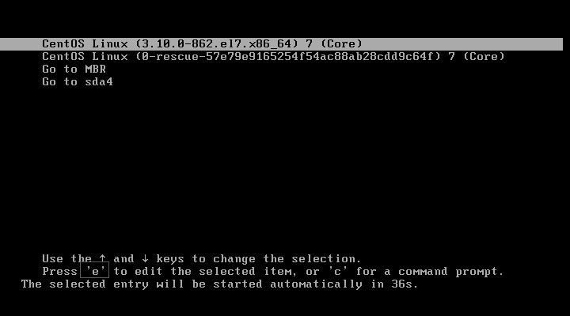
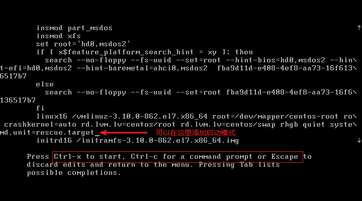
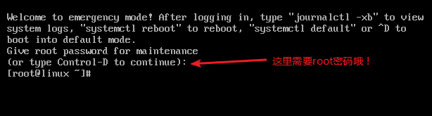

## boot loader 的两个 stage

在前文*开机流程*中提到，在 BIOS 读完信息后，接下来就是会到第一个开机设备的 MBR 去读取 boot loader 了。

但 MBR 是整个硬盘的第一个 sector 内的一个区块，充其量整个大小也才 446 bytes 而已。即使是 GPT 也没有很大的扇区来储存 loader 的数据。这个大小肯定是不够用的。关于磁盘的详细介绍参考《鸟哥的linux私房菜》第二章的*2.2 磁盘分区*小节。

为了解决这个问题，Linux 将 boot loader 的程序代码执行与设定值加载分成两个阶段 (stage)来执行:

- Stage 1：执行 boot loader 主程序：
  第一阶段为执行 boot loader 的主程序，这个主程序必须要被安装在开机区，亦即是 MBR 或者是 boot sector 。但如前所述，因为 MBR 实在太小了，所以，MBR 或 boot sector 通常仅安装 boot loader 的最小主程序， 并没有安装 loader 的相关配置文件；
- Stage 2：主程序加载配置文件：
  第二阶段为透过 boot loader 加载所有配置文件与相关的环境参数文件 (包括文件系统定义与主要配置文件
  `grub.cfg`)， 一般来说，配置文件都在 /boot 底下。

```bash
[root@dev ~]# ls -1p /boot/grub2
device.map	# grub2 的设备对应文件
fonts/		# 开机过程中的画面会使用到的字型数据
grub.cfg	# grub2 的主配置文件
grubenv		# 一些环境区块的符号
i386-pc/	# 针对一般 x86 PC 所需要的 grub2 的相关模块，下面有各种模块
locale/		# 语系相关的数据
```

## /boot/grub2/grub.cfg 初探

grub2 的优点挺多的，包括有:

- 认识与支持较多的文件系统，并且可以使用 grub2 的主程序直接在文件系统中搜寻内核文件名；
- 开机的时候，可以**自行编辑与修改开机设定项目**，类似 bash 的指令模式；
- 可以动态搜寻配置文件，而不需要在修改配置文件后重新安装 grub2 。亦即是我们只要修改完
  `/boot/grub2/grub.cfg` 里头的设定后，下次开机就生效了。

### 磁盘与分区槽在 grub2 中的代号

grub2 对硬盘的识别（info grub2）使用的是如下的代号：

```bash
(hd0,1) # 一般的默认语法,由 grub2 自动判断分区格式
(hd0,msdos1) # 此磁盘的分区为传统的 MBR 模式
(hd0,gpt1) # 此磁盘的分区为 GPT 模式
```

- 硬盘代号以小括号 ( ) 包起来；
- 硬盘以 hd 表示,后面会接一组数字；
- 以**搜寻顺序**做为硬盘的编号！(这个重要！)
- 第一个搜寻到的硬盘为 0 号,第二个为 1 号，以此类推；
- 每颗硬盘的第一个 partition 代号为 1 ，依序类推。

由于 BIOS 可以调整磁盘的开机顺序，因此上述的磁盘对应的 (hdN) 那个号码 N 是可能会变。

例子：

| 硬盘搜寻顺序 | 在 Grub2 当中的代号                              |
| ------------ | ------------------------------------------------ |
| 第一颗(MBR)  | (hd0) (hd0,msdos1) (hd0,msdos2) (hd0,msdos3).... |
| 第二颗(GPT)  | (hd1) (hd1,gpt1) (hd1,gpt2) (hd1,gpt3)....       |
| 第三颗       | (hd2) (hd2,1) (hd2,2) (hd2,3)....                |

第一颗硬盘的 MBR 安装处的硬盘代号就是`(hd0)`，而第一颗硬盘的第一个分区槽的 boot sector 代号就是`(hd0,msdos1)`，第一颗硬盘的第一个逻辑分区槽的 boot sector 代号为`(hd0,msdos5)`。

### /boot/grub2/grub.cfg 配置文件(重点在了解，不要随便改!)

```bash
[root@dev ~]# vi /boot/grub2/grub.cfg
# /etc/grub.d/00_header 这个脚本执行的结果展示,主要与基础设定环境有关
### BEGIN /etc/grub.d/00_header ###
……
if [ x"${feature_menuentry_id}" = xy ]; then
  menuentry_id_option="--id"
else
  menuentry_id_option=""
fi

export menuentry_id_option
……
terminal_output console
if [ x$feature_timeout_style = xy ] ; then
  set timeout_style=menu
  set timeout=5
# Fallback normal timeout code in case the timeout_style feature is
# unavailable.
else
  set timeout=5
fi
### END /etc/grub.d/00_header ###
# /etc/grub.d/10_linux,主要针对实际的 Linux 内核文件的开机环境
### BEGIN /etc/grub.d/10_linux ###
menuentry 'CentOS Linux (3.10.0-1062.el7.x86_64) 7 (Core)' --class centos --class gnu-linux --class gnu --class os --unrestricted $menuentry_id_option 'gnulinux-3.10.0-514.el7.x86_64-advanced-eb74cab9-cb1a-4f23-8719-b876f3b012cd' {
        load_video
        set gfxpayload=keep
        insmod gzio
        insmod part_msdos
        insmod xfs
        set root='hd0,msdos1'
        if [ x$feature_platform_search_hint = xy ]; then
          search --no-floppy --fs-uuid --set=root --hint-bios=hd0,msdos1 --hint-efi=hd0,msdos1 --hint-baremetal=ahci0,msdos1 --hint='hd0,msdos1'  2029e8fc-9ca4-42fe-819e-c3fdead51690
        else
          search --no-floppy --fs-uuid --set=root 2029e8fc-9ca4-42fe-819e-c3fdead51690
        fi
        linux16 /vmlinuz-3.10.0-1062.el7.x86_64 root=/dev/mapper/cl-root ro crashkernel=auto rd.lvm.lv=cl/root rd.lvm.lv=cl/swap rhgb quiet LANG=en_US.UTF-8
        initrd16 /initramfs-3.10.0-1062.el7.x86_64.img
}
……
### END /etc/grub.d/10_linux ###
# 定制菜单
### BEGIN /etc/grub.d/40_custom ###
# This file provides an easy way to add custom menu entries.  Simply type the
# menu entries you want to add after this comment.  Be careful not to change
# the 'exec tail' line above.
### END /etc/grub.d/40_custom ###
……
```

每个 menuentry 就是一个开机选单喽，`{ }`代表选择了该选单后执行的动作，下面是三个比较重要的项目：

- `set root='hd0,msdos1'`

   root 是指定 grub2 配置文件所在的那个设备：

```bash
[root@dev ~]# lsblk -p /dev/sda1
NAME      MAJ:MIN RM SIZE RO TYPE MOUNTPOINT
/dev/sda1   8:1    0   1G  0 part /boot
```

- `linux16 /vmlinuz-...... root=/dev/mapper/cl-root ......`

  这个就是 Linux 内核文件以及内核执行时所下达的参数。内核文件的设定跟上面的 root 有关。有没有 `/boot` 分区是会对文件名有影响的：

  - 如果没有 `/boot` 分区，仅有 `/` 分区：

    /boot/vmlinuz-xxx --> (/)/boot/vmlinuz-xxx --> (hd0,msdos1)/boot/vmlinuz-xxx

  - 如果 `/boot` 是独立分区：

    /boot/vmlinuz-xxx --> (/boot)/vmlinuz-xxx --> (hd0,msdos1)/vmlinuz-xxx

  至于本命令的 root 指的是 `linux 文件系统中，根目录是在哪个装置上` 的意思：

```bash
[root@dev ~]# lsblk -p /dev/sda2
NAME                  MAJ:MIN RM SIZE RO TYPE MOUNTPOINT
/dev/sda2               8:2    0  49G  0 part 
├─/dev/mapper/cl-root 253:0    0  44G  0 lvm  /
└─/dev/mapper/cl-swap 253:1    0   5G  0 lvm  [SWAP]
```

- `initrd16 /initramfs-......`

  这个档名也是需要搭配`set root=xxx`那个项目的装置， 才会得到正确的位置。

## grub2 配置文件维护 /etc/default/grub 与 /etc/grub.d

### 主要环境配置文件

```bash
[root@dev ~]# cat /etc/default/grub 
GRUB_TIMEOUT=5	# 指定预设倒数读秒的秒数
GRUB_DISTRIBUTOR="$(sed 's, release .*$,,g' /etc/system-release)"
GRUB_DEFAULT=saved	# 指定预设由哪一个选单来开机
GRUB_DISABLE_SUBMENU=true	# 是否要隐藏次选单,通常是隐藏
GRUB_TERMINAL_OUTPUT="console"	# 指定数据输出的终端机格式,默认是透过文字终端机
GRUB_CMDLINE_LINUX="crashkernel=auto rd.lvm.lv=cl/root rd.lvm.lv=cl/swap rhgb quiet"	# 就是在 menuentry 括号内的 linux16 项目后续的内核参数
GRUB_DISABLE_RECOVERY="true"	# 取消救援选单的制作
```

- 是否隐藏选单项目：GRUB_TIMEOUT_STYLE

  可选值：menu, countdown, hidden。countdown 会在屏幕上显示剩余的等待秒数，而 hidden 则空空如也。

- 默认开机选单项目：GRUB_DEFAULT

  假设你有三条 menuentry 的项目大约像这样：

```
menuentry '1st linux system' --id 1st-linux-system { ...}
menuentry '2nd linux system' --id 2nd-linux-system { ...}
menuentry '3rd win system' --id 3rd-win-system { ...}
```

  		那么几个常见的设定值是这样的：

```bash
GRUB_DEFAULT=1	# 代表使用第二个 menuentry 开机,因为数字的编号是以 0 号开始编的!
GRUB_DEFAULT=3rd-win-system	# 代表使用第三个 menuentry 开机,因为里头代表的是 ID 的项目!它会找到 --id 喔!
GRUB_DEFAULT=saved	# 代表使用 grub2-set-default 来设定哪一个 menuentry 为默认值的意思。通常预设为 0
```

- 内核的外加参数功能：GRUB_CMDLINE_LINUX

  在内核启动的时候加入额外的参数。

### 选单内置的脚本 /etc/grub.d/*

- 00_header

  主要在建立初始的显示项目。大部分在 `/etc/default/grub` 里面所设定的变量，大概都会在这个脚本当中被利用来重建 grub.cfg 。

- 10_linux

  根据分析 /boot 底下的文件，尝试找到正确的 linux 内核与读取这个内核需要的文件系统模块与参数等，都在这个脚本运作后找到并设定到 grub.cfg 当中。

- 30_os-prober

  这个脚本默认会到系统上找其他的 partition 里面可能含有的操作系统，然后将该操作系统做成选单来处理就是了。使用`GRUB_DISABLE_OS_PROBER=true`来关闭它。

- 40_custom

  在这里补充自定义选单。

一般来说，我们会改动就是仅有 40_custom 这个文件。

#### menuentry 的设置

- 直接指定内核开机

  如果你有比较特别的参数需要修改：(1)先到 grub.cfg 当中取得你要制作的那个内核的选单项目，然后将它复制到40_custom 当中 (2)再到 40_custom 当中依据你的需求修改即可。

- 透过 chainloader 的方式移交 loader 控制权

  grub2 并不需要认识与找出 kernel 的文件名，**只是将 boot 的控制权交给下一个 boot sector 或 MBR 内的 boot loader 而已**。所以通常他也不需要去查验下一个 boot loader 的文件系统。

  一般来说， chain loader 的设定只要两个就够了，一个是预计要前往的 boot sector 所在的分区槽代号，另一个则是设置 chainloader 为那个分区槽的 boot sector (第一个扇区) 上。例子：

```bash
[root@linux ~]# cat /etc/grub.d/40_custom
……
# 将控制权交给 windows 的 loader
menuentry "Windows" {
        insmod chain # 你得要先加载 chainloader 的模块对吧?
        insmod ntfs # 建议加入 windows 所在的文件系统模块较佳!
        set root=(hd0,1) # 是在哪一个分区槽~最重要的项目!
        chainloader +1 # 请去 boot sector 将 loader 软件读出来的意思!
}
# 回到 MBR 的预设环境
menuentry 'Go to MBR' $menuentry_id_option 'mbr' {
        insmod chain
        insmod part_gpt
        set root=(hd0)
        chainloader +1
}
```

### 重新生成配置文件

在每次修改完配置文件后，都需要执行 `grub2-mkconfig` 指令来重新生成 `grub.cfg` 文件

```bash
grub2-mkconfig -o /boot/grub2/grub.cfg
```

## 新建 initramfs 文件

一般来说，需要 initramfs 的时刻为:

- 根目录所在磁盘为 SATA、USB 或 SCSI 等连接接口；
- 根目录所在文件系统为 LVM, RAID 等特殊格式；
- 根目录所在文件系统为非传统 Linux 认识的文件系统时；
- 其他必须要在核心加载时提供的模块。

Linux 内核本身就认识 IDE 接口的磁盘，因此不需要 initramfs 也可以顺利开机。

如果有特殊需要所以想重制 initramfs 文件的话，可以使用 `dracut/mkinitrd` 来处理。

```
dracut [OPTION...] [<image> [<kernel version>]]
生成一个 initramfs 文件

OPTION
	-v, --verbose
	--kver [VERSION]      Set kernel version to [VERSION].
  	-f, --force           Overwrite existing initramfs file.
  	--add-drivers [LIST]  在原本的默认核心模块中,增加某些你想要的模块，模块位于内核所在目录
/lib/modules/$(uname -r)/kernel/*。LIST 格式为 "module1 module2 ..."
	--omit-drivers [LIST] 指定不添加到 initramfs 中的模块。
	--filesystems [LIST]  加入某些额外的文件系统支持
```

```bash
dracut -v --add-drivers "e1000e" --filesystems "ext4 nfs"
```

## 测试与安装 grub2

如果你的 Linux 原来使用的并非 grub2，那么就需要安装了。

首先，你必须要使用 grub-install 将一些必要的文件复制到 `/boot/grub2` 里面去：

```
grub2-install [OPTION...] [INSTALL_DEVICE]

OPTION
	--boot-directory=DIR   install GRUB images under the directory DIR/grub2 instead of the boot/grub2 directory
	-s, --skip-fs-probe    do not probe for filesystems in DEVICE
	--force                install even if problems are detected
	--recheck              delete device map if it already exists
	
INSTALL_DEVICE：要安装的设备
```

基本上，grub2-install 大概仅能安装 grub2 主程序与相关软件到 /boot/grub2/ 那个目录去，**如果后面的设备填的是整个系统 (*/dev/vda, /dev/sda...*)，那 loader 的程序才会写入到 MBR 里面去**。

```bash
# 更新 /boot/grub2/
[root@linux ~]# grub2-install /dev/sda
Installing for i386-pc platform.
Installation finished. No error reported.

[root@linux ~]# ll /boot/grub2/
total 28
drwxr-xr-x. 2 root root   25 Jul 31 14:27 fonts
-rw-r--r--. 1 root root 4287 Jul 31 14:28 grub.cfg
-rw-r--r--. 1 root root 1024 Jul 31 14:28 grubenv
drwxr-xr-x. 2 root root 8192 Dec 11 17:26 i386-pc
drwxr-xr-x. 2 root root 4096 Dec 11 17:26 locale
```

如果是 XFS 文件系统的某个分区，grub2-install 会报错，指出不支持该文件系统：

```bash
# 将 (/dev/sda2) 的 grub2 安装到 /dev/sda4 与 MBR 中
[root@linux ~]# df -Th
Filesystem              Type      Size  Used Avail Use% Mounted on
/dev/mapper/centos-root xfs        10G  1.2G  8.9G  12% /
devtmpfs                devtmpfs  899M     0  899M   0% /dev
tmpfs                   tmpfs     911M     0  911M   0% /dev/shm
tmpfs                   tmpfs     911M  9.6M  902M   2% /run
tmpfs                   tmpfs     911M     0  911M   0% /sys/fs/cgroup
/dev/mapper/centos-home xfs       5.0G   33M  5.0G   1% /home
/dev/sda2               xfs      1014M  142M  873M  14% /boot
tmpfs                   tmpfs     183M     0  183M   0% /run/user/0
/dev/sda4               xfs       2.0G   33M  2.0G   2% /root/sda4

[root@linux ~]# grub2-install /dev/sda4
Installing for i386-pc platform.
grub2-install: error: hd0 appears to contain a xfs filesystem which isn't known to reserve space for DOS-style boot.  Installing GRUB there could result in FILESYSTEM DESTRUCTION if valuable data is overwritten by grub-setup (--skip-fs-probe disables this check, use at your own risk).
[root@linux ~]# grub2-install --skip-fs-probe /dev/sda4
Installing for i386-pc platform.
grub2-install: warning: File system `xfs' doesn't support embedding.
grub2-install: warning: Embedding is not possible.  GRUB can only be installed in this setup by using blocklists.  However, blocklists are UNRELIABLE and their use is discouraged..
grub2-install: error: will not proceed with blocklists.
# 安装成功！！！
[root@linux ~]# grub2-install --skip-fs-probe --force --recheck /dev/sda4
Installing for i386-pc platform.
grub2-install: warning: File system `xfs' doesn't support embedding.
grub2-install: warning: Embedding is not possible.  GRUB can only be installed in this setup by using blocklists.  However, blocklists are UNRELIABLE and their use is discouraged..
Installation finished. No error reported.

[root@linux ~]# ll /boot/grub2/
total 28
drwxr-xr-x. 2 root root   25 Jul 31 14:27 fonts
-rw-r--r--. 1 root root 4287 Jul 31 14:28 grub.cfg
-rw-r--r--. 1 root root 1024 Jul 31 14:28 grubenv
drwxr-xr-x. 2 root root 8192 Dec 11 17:27 i386-pc
drwxr-xr-x. 2 root root 4096 Dec 11 17:27 locale
```

上面这样就将 grub2 的主程序安装到 `/dev/sda4` 以及重新安装到 `MBR` 里面去了。


### 鸟哥举例

!!! important
	如果是多重操作系统就需要重新进入新系统才能够安装啦！

假设你的测试系统上面使用 MBR 分区槽，并且出现如下的数据：

```
[root@study ~]# fdisk -l /dev/vda
   Device Boot      Start         End      Blocks   Id  System
/dev/vda1            2048        6143        2048   83  Linux
/dev/vda2   *        6144     2103295     1048576    7  HPFS/NTFS/exFAT
/dev/vda3         2103296    54540287    26218496   8e  Linux
```

其中 */dev/vda1, /dev/vda3* 是两个 CentOS 7 系统,而 */dev/vda2* 则是 windows 7 系统。

安装的流程是依序 `/dev/vda1 --> /dev/vda2 --> /dev/vda3`。因此，安装好而且重新启动后，系统其实是默认进入 */dev/vda3* 这个 CentOS 7 的系统的。此时 MBR 会去读取的配置文件在 `(/dev/vda3)/boot/grub2/grub.cfg` 才对。

那如何让系统永远都是使用 */dev/vda1* 开机呢？因为 MBR 的 boot loader 应该要去`(/dev/vda1)/boot/grub2/grub.cfg` 读取相关设定才是正常的！所以，你可以使用几种基本的方式来处理：

- 因为 CentOS 7 会主动找到其他操作系统，因此你可以在 /dev/vda3 的开机选单中找到 /dev/vda1 的开机选项，请用该选项进入系统， 你就能够进入 /dev/vda1 了！
- 假设没能抓到 /dev/vda1 ，那你可以在 /dev/vda3 底下使用 `chroot` 来进入 /dev/vda1 喔！
- 使用救援光盘去抓到正确的 /dev/vda1，然后取得 /dev/vda1 的系统喔！

进入系统之后：修改配置文件（可选），`grub2-mkconfig -o /boot/grub2/grub.cfg`，`grub2-install /dev/vda`，就能够让你的 MBR 去取得 /dev/vda1 内的配置文件啰！

## 开机前的额外功能修改

在开机界面可以修改 grub2 的配置哦



在开机界面编辑 grub2，启用救援模式：



**注意**：一旦你退出了编辑界面而不是直接开机，那么所有的编辑都不会保存与生效。



早期 SystemV 的系统中,进入 runlevel 1 的状态是不需要输入 root 密码的！在 systemd 中如果忘记了root密码，就要使用别的方法了！

## 为个别选单加上密码

在 grub2 的选单管理中，有针对两种身份进行密码设定:

- superusers： 设定系统管理员与相关参数还有密码等，使用这个密码的用户，将可在 grub2 内具有所有修
  改的权限。 **但一旦设定了这个 superusers 的参数，则所有的指令修改将会被变成受限制的**！
- users： 设定一般账号的相关参数与密码，可以设定多个用户喔！使用这个密码的用户可以选择要进入某些
  选单项目。 不过，选单项目也得要搭配相对的账号才行喔！(一般来说，使用这种密码的账号并不能修改选
  单的内容，**仅能选择进入选单去开机而已**)

密码的给予有两种语法：

- password_pbkdf2 账号 使用 grub2-mkpasswd-pbkdf2 所产生的密码
- password 账号 没加密的明文密码

password_pbkdf2 的生成方法：

```bash
[root@linux ~]# grub2-mkpasswd-pbkdf2
Enter password:
Reenter password:
PBKDF2 hash of your password is grub.pbkdf2.sha512.10000.D5D87FCB8A91E15669072A33A16EC9B5353A300A6515D102A73167122564FE8BDEE7C6BC3F989BDF574CB6CA1F45EC74A9F5C5B6A040DE67794404D09CA439D7.ADAE646439BC01833A91C9C70D5E3791750A2069E7C3DF4C1BEAA1F6456110F1D41BDB34DE76ED7389A9CFA0F80A79145EC11F9601C4D142D3D0D8D98F0F2C5F
```

把上面生成的hash值放到password_pbkdf2的对应字段中即可。


将账户与menuentry绑定的选项是 `--unrestricted`与 `--user` 。`--unrestricted`表示可以直接开机（无需用户名和密码），`--user`可以指定哪些账户可以使用该选单开机（需要输入用户名和密码）：

```bash
menuentry "大家都可以选择我来开机喔!" --unrestricted {
	set root=(hd0,1)
	chainloader +1
}

menuentry "只有管理员的密码才有办法使用" --users "" {
	set root=(hd0,2)
	chainloader +1
}

menuentry "只有管理员与 dmtsai 才有办法使用喔!" --users dmtsai {
	set root=(hd0,3)
	chainloader +1
}
```

修改完配置文件之后不要忘记重新生成 `grub.cfg` 文件哦！


下面说明一下在哪里定义账户密码。

### grub2 密码设定的文件位置与加密的密码

在鸟哥的版本是这样设置用户名和密码的：

```bash
[root@study ~]# vim /etc/grub.d/01_users
cat << eof
set superusers="vbird"
password_pbkdf2 vbird grub.pbkdf2.sha512.10000.9A2EBF7A1F484904FF3681F97AE22D58DFBFE65A...
password_pbkdf2 dmtsai grub.pbkdf2.sha512.10000.B59584C33BC12F3C9DB8B18BE9F557631473AED...
eof
[root@study ~]# chmod a+x /etc/grub.d/01_users
```

但是在 `CentOS Linux release 7.5.1804 (Core)` 中该文件变成了这样：

```bash
[root@linux ~]# cat /etc/grub.d/01_users
#!/bin/sh -e
cat << EOF
if [ -f \${prefix}/user.cfg ]; then
  source \${prefix}/user.cfg
  if [ -n "\${GRUB2_PASSWORD}" ]; then
    set superusers="root"
    export superusers
    password_pbkdf2 root \${GRUB2_PASSWORD}
  fi
fi
EOF
```

从文件中看出当前版本是在 `${prefix}/user.cfg` 中定义账户密码的，这个 `${prefix}` 在 `grub.cfg`文件中的语句 `if [ -s $prefix/grubenv ];`可以猜测它其实就是目录 `/boot/grub2/`，所以现在我们要在 `/boot/grub2/user.cfg`中定义账户啦：

```bash
[root@linux ~]# cat /boot/grub2/user.cfg
# 定义哪些是超级用户，可以做所有的动作；普通用户只能开机
set superusers="sink"
# 安全的设置密码
password_pbkdf2 sink grub.pbkdf2.sha512.10000.D5D87FCB8A91E15669072A33A16EC9B5353A300A6515D102A73167122564FE8BDEE7C6BC3F989BDF574CB6CA1F45EC74A9F5C5B6A040DE67794404D09CA439D7.ADAE646439BC01833A91C9C70D5E3791750A2069E7C3DF4C1BEAA1F6456110F1D41BDB34DE76ED7389A9CFA0F80A79145EC11F9601C4D142D3D0D8D98F0F2C5F
# 不安全的设置密码
password grub2_user1 1234
```

