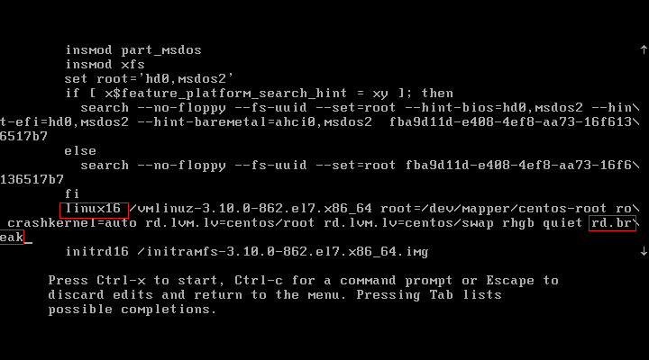
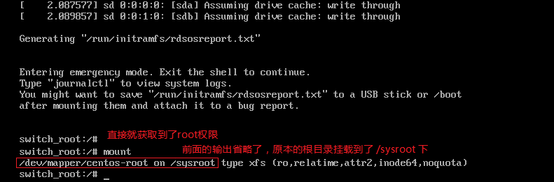
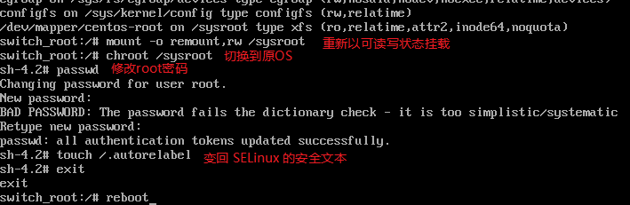
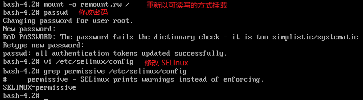
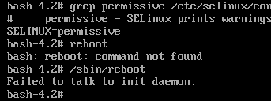

## 忘记 root 密码

只要能够进入OS并且挂载 `/` ， 然后重新设置一下 root 的密码，就OK了。

只是新版的 systemd 的管理机制中，默认的 rescue 模式是无法直接取得 root 权限的，还需要输入密码！

此时可以透过一个名为 `rd.break` 的核心参数来处理。下面列一下步骤。

1. 在开机内核参数中添加`rd.break`



2. 切换到原系统下

   此时是在RAM Disk 的环境，并不是原本的环境。



3. 修改密码

   上图可以看到根目录是以只读的方式挂载的，现在以可读写的方式重新挂载一下并修改密码：




### 为何需要 /.autorelabel

在 rd.break 的 RAM Disk 环境下，系统是没有 SELinux 的，而你刚刚更改了 `/etc/shadow`，所以**这个文件的 SELinux 安全本文的特性将会被取消**！如果你没有让系统于开机时自动的回复 SELinux 的安全本文， 你的系统将产生*无法登入*的问题 (在 SELinux 为 Enforcing 的模式下！)加上 `/.autorelabel` 就是要让系统在开机的时候自动的使用预设的 SELinux type 重新写入 SELinux 安全本文到每个文件去！

不过加上 /.autorelabel 之后，系统在开机就会重新写入 SELinux 的 type 到每个文件，因此会花不少的时间。如果你不想要花太多时间，还有个方法可以处理：

- 在 rd.break 模式下，修改完 root 密码后，将 `/etc/selinux/config` 内的 SELinux 类型改为`permissive`
- 重新启动后，使用 root 的身份下达 `restorecon -Rv /etc` 仅修改 /etc 底下的文件
- 重新修改 `/etc/selinux/config` 改回 enforcing ，然后 `setenforce 1` 即可！

## 直接开机就以 root 执行 bash 的方法

除了上述的 rd.break 之外，我们还可以直接开机取得系统根目录后，让系统直接丢一个 bash 给我们使用。

同在 linux16 的那一行，最后面不要使用 rd.break 而是使用 `init=/bin/bash` 即可！ 最后开机完成就会丢一个 bash 给我们！同样不需要 root 密码而有 root 权限！



但是要完整的操作该系统是不可能的，因为我们将 PID 一号更改为 bash 啦！所以连 PATH 都仅有 /bin 而已~所以你不能下达 reboot：



**此时只能按下 reset 或者是强制关机后，才能再次开机**！

重启后恢复一下SELinux：

```bash
[root@linux ~]# getenforce
Permissive
[root@linux ~]# vi /etc/selinux/config
[root@linux ~]# grep enforcing /etc/selinux/config
#     enforcing - SELinux security policy is enforced.
#     permissive - SELinux prints warnings instead of enforcing.
SELINUX=enforcing
[root@linux ~]# restorecon -Rv /etc/
restorecon reset /etc/shadow context system_u:object_r:unlabeled_t:s0->system_u:object_r:shadow_t:s0
restorecon reset /etc/selinux/config context system_u:object_r:unlabeled_t:s0->system_u:object_r:selinux_config_t:s0
[root@linux ~]# setenforce 1
```

## 文件系统错误而无法开机

最容易出错的设定而导致无法顺利开机的步骤，通常就是 `/etc/fstab` 这个文件了，尤其是使用者在操作 `Quota/LVM/RAID` 时，最容易写错参数， 又没有经过 `mount -a` 来测试挂载，就立刻直接重新启动！

这种情况一般都会告诉你是哪个文件系统出了问题，以root登录之后重新以可读写的方式挂载 `/`，继续处理。

如果是扇区错乱的情况，就需要使用磁盘修复工具 `fsck` 、`xfs_repair`  修复喽。

而且如果你的 partition 上面的 filesystem 有过多的数据损毁时，即使 `fsck/xfs_repair` 完成后，可能因为伤到系统槽，导致某些关键系统文件数据的损毁，那么依旧是无法进入 Linux 的。此时，就好就是将系统当中的重要数据复制出来，然后重新安装，并且检验一下，是否实体硬盘有损伤的现象。