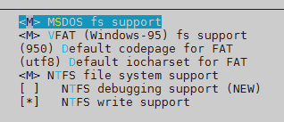

编译内核的动机可以归纳为几大类：

- 新功能的需求
- 原本内核太过臃肿
- 与硬件搭配的稳定性
- 其他需求 (如嵌入式系统)

## 下载内核源码

内核下载网址：https://mirror.bjtu.edu.cn/kernel/linux/kernel/v3.x/

```bash
[root@linux ~]# cd /usr/src/kernels/
[root@linux kernels]# wget https://mirror.bjtu.edu.cn/kernel/linux/kernel/v3.x/linux-3.18.140.tar.xz
[root@linux kernels]# tar -Jxf linux-3.18.140
[root@linux kernels]# cd linux-3.18.140
```

或到centos的网站下载 kernel 的SRPM包，然后从里面获取：

```bash
[root@dev src]# wget http://vault.centos.org/7.7.1908/os/Source/SPackages/kernel-3.10.0-1062.el7.src.rpm
[root@dev src]# rpm -ivh kernel-3.10.0-1062.el7.src.rpm
[root@dev src]# cd ～/rpmbuild/SOURCES/
[root@dev SOURCES]# ll linux-3.10.0-1062.el7.tar.xz -h
-rw-rw-r--. 1 root root 89M Aug  7 21:40 linux-3.10.0-1062.el7.tar.xz
[root@dev SOURCES]# tar -Jxf linux-3.10.0-1062.el7.tar.xz -C /usr/local/src/
[root@dev SOURCES]# cd /usr/local/src/linux-3.10.0-1062.el7/
```

## 内核编译前的处理与内核功能选择

### 编译前的工作

- 查看主机硬件环境
- 清理源码残留的文件。主要用于删除前一次编译过程的残留数据。

```bash
# 删除编译过程产生的目标文件以及配置文件
[root@dev linux-3.18.140]# make mrproper
```

**注意**：内核功能选择文件也会被删除掉！

### 选择内核功能

```bash
[root@linux linux-3.18.140]# make mrproper
# /boot/config-xxx 文件就是 .config 文件
[root@linux linux-3.18.140]# cp /boot/config-3.10.0-862.el7.x86_64 .config
[root@linux linux-3.18.140]# make menuconfig
```


General setup


loadable module + block layer


CPU 的类型与功能选择


电源管理功能


一些总线 (bus) 的选项


编译后执行文件的格式


内核的网络功能


各种设备的驱动程序


文件系统支持





安全选项


虚拟化


save之后exit即可。

## 内核的编译与安装

### 编译内核与模块

```bash
make vmlinux	# 未经压缩的内核
make modules	# 仅内核模块
make bzImage	# 经压缩过的内核(预设)
make all		# 进行上述的三个动作
```

更多的选项通过`make help`来查看吧。

执行：

```bash
[root@linux linux-3.18.140]# make -j 1 clean	# 清除临时文件
[root@linux linux-3.18.140]# make -j 1 bzImage	# 编译压缩的内核
……
CRC 1d0071b2
Kernel: arch/x86/boot/bzImage is ready  (#2)
[root@linux linux-3.18.140]# make -j 1 modules	# 再编译模块
或者一步到位：
[root@linux linux-3.18.140]# make -j 1 clean bzImage modules
```

在上面的编译过程当中，如果有发生任何错误的话， 很可能是由于内核项目的选择问题，可能你需要重新以 `make menuconfig` 再次检查一下你的相关设定。如果还是无法成功的话，那么或许将原本的内核数据内的 `.config` 文件，复制到你的内核原始文件目录下， 然后加以修改，应该就可以顺利的编译出你的内核了。

### 安装内核模块

内核模块是放置在 `/lib/modules/$(uname -r)` 下面的，但是同一个版本的模块被反复编译后来安装时，就会产生冲突，解决办法有两个：

- 先重命名旧的模块目录，然后才安装模块到目标目录去；
- 在 `make menuconfig` 时，把那个 `General setup` 内的 `Local version` 修改成新的名称。

鸟哥建议使用第二个方式。

```bash
[root@linux linux-3.18.140]# make modules_install
[root@linux linux-3.18.140]# ll /lib/modules/
total 8
drwxr-xr-x. 7 root root 4096 Jul 31 14:27 3.10.0-862.el7.x86_64
# 这个就是新编译的模块的安装目录
drwxr-xr-x. 3 root root 4096 Dec 30 10:26 3.18.140
```

### 安装内核与制作选单

#### 复制内核文件

编译完成的内核位于 `/usr/src/kernels/linux-3.18.140/arch/x86/boot/bzImage`，但在前文中提过系统内核理应位于 `/boot` 下面，且以 `vmlinuz` 开头的文件名。

```bash
[root@linux linux-3.18.140]# file arch/x86/boot/bzImage
arch/x86/boot/bzImage: Linux kernel x86 boot executable bzImage, version 3.18.140 (root@linux.study) #2 SMP Mon Dec 30 09:53:07 CST 2019, RO-rootFS, swap_dev 0x5, Normal VGA
# 内核文件
[root@linux linux-3.18.140]# cp arch/x86/boot/bzImage /boot/vmlinuz-3.18.140
[root@linux linux-3.18.140]# chmod +x /boot/vmlinuz-3.18.140
[root@linux linux-3.18.140]# cp .config /boot/config-3.18.140
[root@linux linux-3.18.140]# gzip -c Module.symvers > /boot/symvers-3.18.140.gz
# 设置一下 SELinux 
[root@linux linux-3.18.140]# restorecon -Rv /boot/
restorecon reset /boot/System.map-3.18.140 context unconfined_u:object_r:boot_t:s0->unconfined_u:object_r:system_map_t:s0 
```

#### 创建 Initial Ram Disk

关于何时需要创建该文件参考：[新建 initramfs 文件](../24 grub2/#4-initramfs)

```bash
[root@linux linux-3.18.140]# dracut -v /boot/initramfs-3.18.140.img 3.18.140
```

#### 制作开机选单

```bash
[root@linux linux-3.18.140]# grub2-mkconfig -o /boot/grub2/grub.cfg
Generating grub configuration file ...
Found linux image: /boot/vmlinuz-3.18.140
Found initrd image: /boot/initramfs-3.18.140.img
Found linux image: /boot/vmlinuz-3.10.0-862.el7.x86_64
Found initrd image: /boot/initramfs-3.10.0-862.el7.x86_64.img
Found linux image: /boot/vmlinuz-0-rescue-57e79e9165254f54ac88ab28cdd9c64f
Found initrd image: /boot/initramfs-0-rescue-57e79e9165254f54ac88ab28cdd9c64f.img
done
```

预设较新版本的内核会放在最前面成为默认的开机选单项目。

上述步骤全部成功之后就可以重启选择新内核开机啦！

但是我编译的内核并没有顺利的开机～是因为 `device-mapper driver` 模块加载出错（`modprobe: ERROR: could not insert 'dm_mod': Exec format error`），导致无法识别分区：


## 单独编译内核模块

大致流程：

1. 下载 kernel 的源码，置于 `/usr/src/kernels/` 下面。因为厂商的驱动都是根据 kernel 来开发的，所以会用到对应 kernel 的头文件之类的东西，这些文件是源码所提供的，所以需要安装 kenel 源码。也可以安装 `kernel-devel` 包来直接安装内核源码。**在编译时指定的内核版本必须有它的源码存在**。内核以`/lib/modules/$(uname -r)/{build,source}` 两个链接文件指向的就是源码所在处。

```bash
[root@linux ～]# ll /lib/modules/3.18.140/
total 2768
lrwxrwxrwx.  1 root root     31 Dec 30 10:12 build -> /usr/src/kernels/linux-3.18.140
drwxr-xr-x. 11 root root    116 Dec 30 10:25 kernel
……
-rw-r--r--.  1 root root 305836 Dec 30 10:26 modules.symbols
-rw-r--r--.  1 root root 380795 Dec 30 10:26 modules.symbols.bin
lrwxrwxrwx.  1 root root     31 Dec 30 10:12 source -> /usr/src/kernels/linux-3.18.140
```

2. 获取驱动源码，编译驱动模块。获取到源码之后，**一定要参考 `README` 文件**，然后对源码进行编译，最后放到正确的目录下。
3. 生成模块依赖文件并加载。

```bash
# 模块依赖文件
depmod -a
# 若是对当前正在使用的 kernel 编译的驱动，那么可以尝试加载
modprobe rr640l
# 想要开机时就加载此模块
dracut --force -v --add-drivers rr640l /boot/initramfs-3.18.140.img 3.18.140
# 查看是否已经在 initramfs 中
lsinitrd /boot/initramfs-3.18.140 | grep rr640
```

### 举例

#### 获取内核源码

```bash
[root@dev tmp]# uname -a
Linux dev 3.10.0-1062.el7.x86_64 #1 SMP Wed Aug 7 18:08:02 UTC 2019 x86_64 x86_64 x86_64 GNU/Linux
# 与当前运行的内核版本一致
[root@dev tmp]# yum install kernel-devel-3.10.0-1062.el7.x86_64
# 源码已经安装了
[root@dev tmp]# ls -d /usr/src/kernels/3.10.0-1062.el7.x86_64/
/usr/src/kernels/3.10.0-1062.el7.x86_64/
```

#### 获取驱动源码并编译

鸟哥的例子中所用的驱动在当前不能使用，我又找了一个英特尔的驱动：https://downloadcenter.intel.com/zh-cn/download/27981/-Linux-

```bash
[root@dev tmp]# unzip Intel_MR_Linux_drv_7.5-07.705.04.00_pv.zip
[root@dev tmp]# cd Intel_MR_Linux_drv_7.5-07.705.04.00_pv/
[root@dev Intel_MR_Linux_drv_7.5-07.705.04.00_pv]# ll
total 28888
-rw-r--r--. 1 root root    10132 Oct 31  2017 Installation_Readme.txt
-rw-r--r--. 1 root root    11384 May 23  2017 License_v2.pdf
-r--r--r--. 1 root root 29525408 Mar  1  2018 megaraid_sas_components.tgz
-rw-r--r--. 1 root root    18073 Jun 19  2018 MR_Linux_drv_v07.705.04.00_readme.txt
-r--r--r--. 1 root root     4936 Mar  1  2018 OS_Support_list_mr7.5.txt
```

在查看了 Installation_Readme.txt 文件之后，了解到后续步骤是：

```
1) Untar driver source tarball-
#tar -zxvf megaraid_sas-<driver_version>-src.tar.gz

2) Go to driver source directory-
#cd megaraid_sas-<driver_version>/

3) To compile the driver for distro use the helper script
"compile.sh" bundled inside source code-
#./compile.sh
```

```bash
[root@dev Intel_MR_Linux_drv_7.5-07.705.04.00_pv]# mkdir megaraid_sas
[root@dev Intel_MR_Linux_drv_7.5-07.705.04.00_pv]# tar -zxf megaraid_sas_components.tgz -C megaraid_sas
[root@dev Intel_MR_Linux_drv_7.5-07.705.04.00_pv]# cd megaraid_sas/
# 下面是一些已经做成各种版本和形式的文件，还有源码的压缩包
[root@dev megaraid_sas]# ll
total 144
drwxrwxr-x. 3 500 nginx     20 Mar  1  2018 citrix7
drwxrwxr-x. 2 500 nginx    128 Mar  1  2018 dkms-rpms-1
drwxr-xr-x. 2 500 nginx     49 Mar  1  2018 generic_srpm
drwxr-xr-x. 2 500 nginx     49 Mar  1  2018 kmod_srpm
drwxr-xr-x. 2 500 nginx     53 Mar  1  2018 kmp_srpm
-rwxrw-r--. 1 500 nginx 143926 Mar  1  2018 megaraid_sas-07.705.04.00-src.tar.gz
drwxrwxr-x. 3 500 nginx     20 Mar  1  2018 oel6_uek
drwxrwxr-x. 3 500 nginx     20 Mar  1  2018 oel7_uek
drwxrwxr-x. 4 500 nginx     35 Mar  1  2018 rhel6_oel6_centos6
drwxrwxr-x. 4 500 nginx     35 Mar  1  2018 rhel7_oel7_centos7
drwxrwxr-x. 4 500 nginx     35 Mar  1  2018 sles11
drwxrwxr-x. 4 500 nginx     35 Mar  1  2018 sles12
drwxrwxr-x. 3 500 nginx     20 Mar  1  2018 ubuntu
# 解压源码包
[root@dev megaraid_sas]# tar -zxf megaraid_sas-07.705.04.00-src.tar.gz
[root@dev megaraid_sas]# cd megaraid_sas-07.705.04.00/
[root@dev megaraid_sas-07.705.04.00]# ll
total 620
-r-xr-xr-x. 1 root root   1439 Feb 28  2018 compile.sh
-r-xr-xr-x. 1 root root   1819 Feb 28  2018 dkms.conf
-r-xr-xr-x. 1 root root    109 Feb 28  2018 Makefile
-r-xr-xr-x. 1 root root   1021 Feb 28  2018 Makefile.standalone
-r-xr-xr-x. 1 root root 288460 Feb 28  2018 megaraid_sas_base.c
-r-xr-xr-x. 1 root root  40784 Feb 28  2018 megaraid_sas_fp.c
-r-xr-xr-x. 1 root root 150733 Feb 28  2018 megaraid_sas_fusion.c
-r-xr-xr-x. 1 root root  52563 Feb 28  2018 megaraid_sas_fusion.h
-r-xr-xr-x. 1 root root  81914 Feb 28  2018 megaraid_sas.h
# 经查看 compile.sh 发现可以在脚步里面指定 kernel 的版本，那么修改成想要适配的版本：
[root@dev megaraid_sas-07.705.04.00]# vi compile.sh
        kernel="3.10.0-1062.el7.x86_64"
# 编译
[root@dev megaraid_sas-07.705.04.00]# ./compile.sh
[root@dev megaraid_sas-07.705.04.00]# ll *.ko
-rw-r--r--. 1 root root 2705768 Dec 30 17:07 megaraid_sas.ko
```

#### 生成模块依赖文件并加载

```bash
# 先查看一下有没有这个驱动
[root@dev megaraid_sas-07.705.04.00]# modinfo megaraid_sas
filename:       /lib/modules/3.10.0-1062.el7.x86_64/kernel/drivers/scsi/megaraid/megaraid_sas.ko.xz
……
# 已经存在了，那么替换掉试试
# 先卸载
[root@dev megaraid_sas-07.705.04.00]# modprobe -r megaraid_sas
# 备份
[root@dev megaraid_sas-07.705.04.00]# mv /lib/modules/3.10.0-1062.el7.x86_64/kernel/drivers/scsi/megaraid/megaraid_sas.ko.xz /home/
[root@dev megaraid_sas-07.705.04.00]# xz -k megaraid_sas.ko
# 复制
[root@dev megaraid_sas-07.705.04.00]# cp megaraid_sas.ko.xz /lib/modules/3.10.0-1062.el7.x86_64/kernel/drivers/scsi/megaraid/megaraid_sas.ko.xz
# 生成模块依赖文件
[root@dev megaraid_sas-07.705.04.00]# depmod -a
# OK，成功加载
[root@dev megaraid_sas-07.705.04.00]# modprobe megaraid_sas
[root@dev megaraid_sas-07.705.04.00]# lsmod | grep megaraid_sas
megaraid_sas          172871  0
```

### 利用原有的内核源码进行编译

仅重新编译内核模块的情况。下面以 ntfs 举例：

先到目前的内核源码所在目录下达 `make menuconfig` ，然后将 NTFS 的选项设定成为模块，然后下达 `make fs/ntfs/`，那么 ntfs 的模块 (ntfs.ko) 就会自动的被编译出来了。然后将该模块复制到
`/lib/modules/3.18.140/kernel/fs/ntsf/` 目录下, 再执行 `depmod -a`，就完成了在现有内核下新增模块的功能了。


!!! important
	在阅读完上文后，你应该知道：当内核更新之后，自己之前所编译的内核模块会失效！

## 编译打包最新版的 CentOS 7.x 内核

除了安装上述步骤来编译之外，你还可以使用 [ELRepo](http://elrepo.org/tiki/tiki-index.php) 网站提供的 SRPM 来重新编译打包，或使用该网站提供的 CentOS 7.x 来直接安装。编译时除了解决依赖问题，还必须要有足够的空间！

下面使用 SRPM 来编译打包。

```bash
# 从 ELReo 获取 SRPM
[root@dev ~]# wget https://elrepo.org/linux/kernel/el7/SRPMS/kernel-ml-5.4.7-1.el7.elrepo.nosrc.rpm
[root@dev ~]# rpm -ivh kernel-ml-5.4.7-1.el7.elrepo.nosrc.rpm
# 根据版本获取内核源码。这一步可以跳过，编译时会自动下载。从内核网站 https://www.kernel.org/ 进入。
[root@dev ~]# cd rpmbuild/SOURCES/
[root@dev SOURCES]# wget https://mirrors.edge.kernel.org/pub/linux/kernel/v5.x/linux-5.4.7.tar.xz

[root@dev SOURCES]# ls -1
config-5.4.7-x86_64		# 选单文件
cpupower.config
cpupower.service
linux-5.4.7.tar.xz		# 内核源码
```

然后你可以修改配置文件，就像鸟哥这样：

```bash
[root@dev SOURCES]# vi config-5.4.7-x86_64
# CONFIG_VFIO_PCI_VGA is not set
CONFIG_VFIO_PCI_VGA=y
```

编译打包：

```bash
[root@dev SOURCES]# cd ../SPECS/
# 如果刚刚下载过了内核源码，所以这里就不需要再次下载了，把它改掉
[root@dev SPECS]# vi kernel-ml-5.4.spec
# Sources.
# Source0: https://www.kernel.org/pub/linux/kernel/v5.x/linux-%{LKAver}.tar.xz
Source0: linux-%{LKAver}.tar.xz
[root@dev SPECS]# rpmbuild -bb kernel-ml-5.4.spec
```

一切正常的情况下，最后会输出一系列的 RPM 包，这样就可以直接安装内核并重启使用，而不用像上文那样一步步地操作啦！

## 内核编译的步骤小结

1. 先下载内核源码，可以从 http://www.kernel.org 或者是 distributions 的 SRPM 来着手；
2. 以下以 Tarball 来处理，解压源码到 /usr/src/kernels 目录下；
3. 先进行旧数据删除的动作：`make mrproper`；
4. 开始挑选内核功能，可以利用`make menuconfig`、`make oldconfig`、`make gconfig`等等；
5. 清除过去的中间暂存盘资料：`make clean`
6. 开始内核文件与内核模块的编译：`make bzImage`、`make modules`
7. 开始内核模块的安装：`make modules_install`
8. 开始内核文件的安装，可以使用的方式有：`make install`或者是通过过手动的方式复制内核文件到 /boot/ 当中；
9. 建立 initramfs 文件；
10. 使用 g`rub2-mkconfig` 修改 /boot/grub2/grub.cfg 文件。